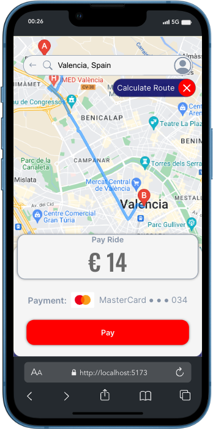
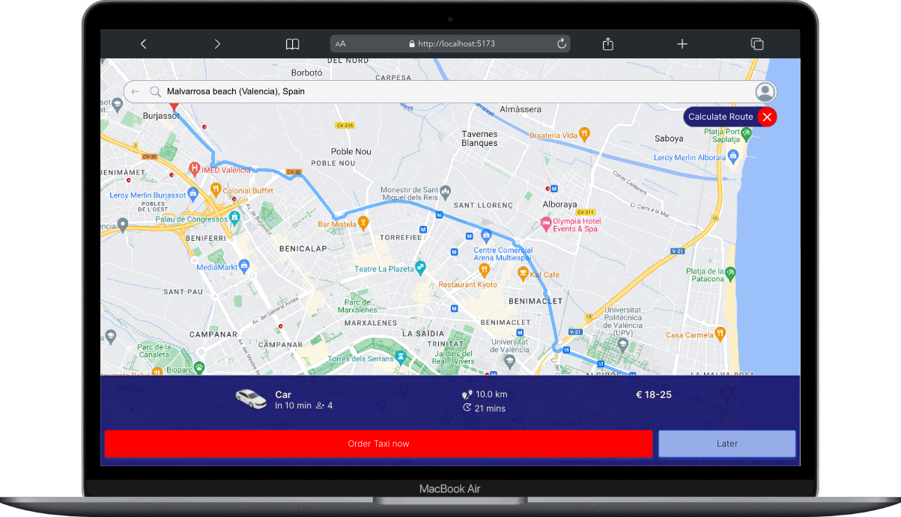
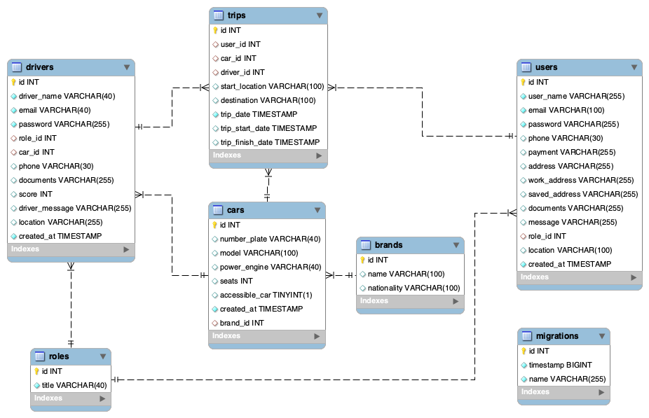

### Mobility App Backend

---

###### Mobility App

<div style="display: flex; justify-content: space-around;">
<center></center>
<center></center>
</div>

---

Thank you very much for your interest in my project. It's the last proyect, a complete full stack project with Geekshubs Academy of the Full Stack Development Bootcamp 🚀.

---

<div>

[![GITHUB]][github-url][![DOCKER]][docker-url][![MYSQL]][MYSQL-url][![Node][Node.JS]][Node.JS-url][![Express][Express.js]][Express.js-url]<a href="https://www.typescriptlang.org/"></a>[![js]][js-url][![JWT]][JWT-url]

[JWT]: https://img.shields.io/badge/JWT-black?style=for-the-badge&logo=JSON%20web%20tokens
[JWT-url]: https://jwt.io/
[Express.js]: https://img.shields.io/badge/express.js-%23404d59.svg?style=for-the-badge&logo=express&logoColor=%2361DAFB
[Express.js-url]: https://expressjs.com/
[Node.JS]: https://img.shields.io/badge/node.js-026E00?style=for-the-badge&logo=node.js&logoColor=white
[Node.JS-url]: https://nextjs.org/
[MYSQL]: https://img.shields.io/badge/mysql-3E6E93?style=for-the-badge&logo=mysql&logoColor=white
[MYSQL-url]: https://www.mysql.com/
[GITHUB]: https://img.shields.io/badge/github-24292F?style=for-the-badge&logo=github&logoColor=white
[github-url]: https://www.github.com/
[GIT]: https://img.shields.io/badge/git-F54D27?style=for-the-badge&logo=git&logoColor=white
[git-url]: https://git-scm.com/
[LINKEDIN]: https://img.shields.io/badge/linkedin-0274B3?style=for-the-badge&logo=linkedin&logoColor=white
[LINKEDIN-url]: https://www.linkedin.com/
[JS]: https://img.shields.io/badge/javascipt-EFD81D?style=for-the-badge&logo=javascript&logoColor=black
[js-url]: https://developer.mozilla.org/es/docs/Web/JavaScript
[DOCKER]: https://img.shields.io/badge/docker-2496ED?style=for-the-badge&logo=docker&logoColor=white
[docker-url]: https://www.docker.com/
[sequelize-url]: https://www.sequelize.org/
[gmail-url]: https://www.gmail.com/

 </div>
<details>
  <summary style="font-weight:bolder" >Contents 🗂️</summary>
  <ol>
    <li><a href="#Full Description">Full Description</a></li>
    <li><a href="#Data Base diagram">Data Base diagram</a></li>
    <li><a href="#Tasks">Tasks</a></li>
    <li><a href="#instalation & Develop">Instalation & Develop</a></li>
    <li><a href="#author">Author / Contact </a></li>
  </ol>
</details>

###### It an app to hire a service to transport people from one place to another paying a price for it..

<details>
  <summary style="font-weight:bolder">Full Description 📝</summary>
  <ol>
Users can register for the application, log in and access it. 
They can search for a destination, choose from different types of cars and make the trip.
 A driver responds to the request and picks up the passenger. 
Once the trip is completed, they can rate the driver.
Users must complete their profile and choose the payment method.
They can also access their trip history.

  </ol>
</details>

##### Data Base Diagram

<!-- <div style="display: flex; justify-content: space-around;">
<center>
</center>
</div> -->

<div style="display: flex; justify-content: space-around;">
<center>
</center>
</div>

#### Tasks 📝

<li> Create a Data Base</li>
<li> Migrations & Seeders for all tables.
<li> Endpoints</li>

<details>
  <summary style="padding-left:15px; color:darkgray"> View endopints</summary>
<ol>

---

<ol style="color:green;font-weight:bolder"> Authentication</ol>

---

<li > Register Users</li>

POST `localhost:5500/auth/register`

<li> Login</li>

POST `https://localhost:5500/auth/login`

---

<li > Register Drivers</li>

POST `localhost:5500/auth/drivers/register`

<li> Login</li>

POST `localhost:5500/auth/drivers/login`

---

<ol style="color:green;font-weight:bolder"> Users</ol>

---

<li> Get All Users with pagination </li>

GET `http://localhost:5500/users`

---

<li> Pagination example </li>

` "url_example_of_pagination":"http://localhost:5500/users?page=2",`

` "url_example_of_pagination1":"http://localhost:5500/users?limit=20",`

`  "url_example_of_pagination2":"http://localhost:5500/users?page=3&limit=15"`

---

<li> Get User Profile</li>

GET `http://localhost:5500/users/profile`

---

<li> Update User Profile</li>

PUT `http://localhost:5500/users/profile`

{
"userName": "Jhon Smith",
"phone": "+3461371436",
"address": "carrer xativa 20",
"payment": "credit"
}

---

<li> Delete User by Id</li>

DELETE `http://localhost:5500/users/:id`

---

<li> Delete one User or more by Id arrays (superAdmin) </li>

DELETE `http://localhost:5500/users`

`{
"usersId" : [4,5,7,5,78,2]
}`

`{
"usersId" : [12]
}`

---

<li> Get Users with search by query </li>

GET `http://localhost:5500/users/search?search=email`

GET `http://localhost:5500/users/search?search=name`

---

<li> Create Trip </li>

POST `http://localhost:5500/trips/`

{
"startLocation": "[39.5102451,-0.4115579]",
"destination": "Valencia, Spain",
"driverId": 3
}

---

<li> Get all Trips (Super_admin) </li>

GET `http://localhost:5500/trips/all`

---

<li> Get my all Trips (TOKEN) </li>

PUT `http://localhost:5500/trips/:id`

---

<li> Get trips by Id (TOKEN) </li>

GET `http://localhost:5500/trips`

---

<li> Update Trip (TOKEN) </li>

PUT `http://localhost:5500/trips/`

{
"tripDate": "2024-05-01 19:00:00",
"trip_id": 23,
"driverId": 4,
"startLocation": "Godella",
"destination":"Palau de Congresos",
"carId":2
}

---

<li> Update Trip by Id (TOKEN) </li>

PUT `http://localhost:5500/trips/:id`

---

<li> Delete Trip by Id (TOKEN) </li>

DELETE `http://localhost:5500/trips/:id`

---

<li> Delete more than one Trips by Id array (superAdmin)  </li>

DELETE `http://localhost:5500/trips`

{
"tripsId" : [4,2,5,6,8,10]
}

{
"tripsId" : [6]
}

---

<li> Get All Drivers with pagination </li>

GET `http://localhost:5500/drivers`

---

<li>Pagination Example</li>

`url_example_of_pagination":"http://localhost:5500/drivers?page=2`

`"url_example_of_pagination1":"http://localhost:5500/drivers?limit=20",`

`"url_example_of_pagination2":"http://localhost:5500/drivers?page=3&limit=15"`

---

<li> Get Driver Profile</li>

GET `http://localhost:5500/drivers/profile`

---

<li> Update Driver Profile</li>

PUT `http://localhost:5500/drivers/profile`

---

<li> Delete Driver by Id</li>

DELETE `http://localhost:5500/drivers/:id`

---

<li> Delete one Driver or more by Id arrays (superAdmin) </li>

DELETE `http://localhost:5500/drivers`

{
"driversId" : [4,5,7,5,78,2]
}

{
"driversId" : [12]
}

---

`All non-public endpoints with corresponding middlewares`

<ol>We can find here the collection of all endpoints in Thunder Client:
You have to open Thunder Client
Go to collections
Import this file:
</ol>
</div>
<br>

`./HTTP/thunder-collection_TAXI APP.json`

---

</ol>

</details>
<br>

#### Instalation & Develop ⛏️

<!-- End previously item -->
<ol>
 <details>
  <summary style="padding-left:1px; font-weight:bolder">1. INSTALL DOCKER

![DOCKER]</summary>

  <ol>
   <li> Install docker and run this command to get a container</li>

`$ docker run --name mysql-exampleName -p 3309:3306 -e MYSQL_ROOT_PASSWORD=1234 -d mysql`

<li>Example</li>

`$ mysql -h localhost -P 3306 -u root -p you will need -h (host), -P (port), -u(username) and -p (password)`

   </ol>
</details>
<!-- End previously item -->

<details>
<summary style="font-weight:bolder;margin-top:-20px" >2. INSTALL EXPRESS

![Express][Express.js]

</summary>
<ol>

`$ npm init `

<li>Run follow command to create "package-lock.json" install node_modules</li>

`$ npm install express --save`

<li>
  Create .gitignore in root and add "./node_modules" , ".env" and ".dist" to
  avoid upload to github repository
</li>
<li>
  
</li>

`$ npm install typescript -D`

<li>Create the 'tsconfig.json' file</li>

`$ npx tsc --init`

<li>Install types/express & node</li>

`$ npm install @types/express @types/node -D`

<li>Install dependencies to compile TS (nodemon)</li>

` $ npm install ts-node nodemon -D`

<li style="color:gray;font-weight:thin">
  Create ".env" and ".env.example" file The .env file has the key & value
  credentials to access to the data base. It should not be visible, for this
  reason we add it to .gitingnore. The ".env.example" files have the same
  structure to build your ".env" file on your local
</li>
<li>Put the follow keys in .env file.</li>

```js

PORT =4XXX

#conexion a bd
DB_USER=root
DB_PASSWORD=XXXX
DB_PORT=33XX
DB_HOST=localhost
DB_DATABASE=dataBaseName

# JWT

JWT_SECRET=xxxxxx

```

<br />
<li>
  Install 'dotenv' to added th depencencies and will grab data from the .env
  file
</li>

` $ npm install dotenv`

<li>
  DOTENV - Create the folder "src" with "server.ts" file inside. This the code
  to connect to the server.
</li>

```js
import "dotenv/config"

import { app } from "./app"
import { AppDataSource } from "./database/db"

const PORT = process.env.PORT || 5500

const startServer = () => {
  AppDataSource.initialize()
    .then(() => {
      console.log("database connected")
      app.listen(PORT, () => {
        console.log(`Server is running on port: ${PORT}`)
      })
    })
    .catch((error: any) => {
      console.log("error")
    })
}

startServer()
```

<!-- End previously item -->
<li>We create app.ts file</li>

```js
// links to .env file
import express, { Application } from "express"
import "dotenv/config"
import { authRouter } from "./routes/authRoutes"

// export app function export
const app: Application = express()
// parses response to .json
app.use(express.json())
// testing request
app.get("/healthy", (req, res) => {
  res.status(200).json({
    success: true,
    message: "Server is healthy",
  })
})
// auth Users & Drivers
app.use("/", authRouter) //<-- Route Example
```

<!-- End previously item -->

</ol>
<!-- End previously item -->
</details>
<!-- End previously item -->

<details>
<summary style="font-weight:bolder; margin-top:-20px" >3. CREATE MYSQL

![MYSQL]</summary>

<ol>
<li>Think and rethink the database, avoid redundancy between keys and related tables. Identify primary keys (PK) and foreign keys (FK). Choose the type of value, if it is 'NULL' (not required) or can be 'UNIQUE' fields.
</li>
 <li>Open Mysql Workbench and set up new dataBase connection
</li>

<li>

`$ npm run dev `

---

 </ol>
</details>
<!-- End previously item -->
<details>
  <summary style="font-weight:bolder; margin-top:-5px" >4. MIGRATIONS & MODELS</summary>

- Creating MIGRATIONS [Data Definition Language (DDL): with typeorm]:
  `$ npm run run-migrations`
  `./src/database/migrations`

  <li>It's possible that's need populate with one basic table before continue with the migrations
  go to the point <a href="#11.run--project">11.Run Project</a></li>

- Adding them to `DataSource.migrations` in the `db.ts` file: `Role, User, Driver, Trip, Car, Brand `

- Creating MODELS (entities) [Data Manipulation Language (DML)]

- Adding them to `DataSource.entities` in the `db.ts` file: `Roles, Users, Drivers, Trips, Cars, Brands`

</details>

<details>
  <summary style="font-weight:bolder" >5. CONTROLLERS</summary>

- We create controllers (in a folder on the same level with `package.json`): > `auth, users, drivers, trips`

</details>

<details>
  <summary style="font-weight:bolder" >6. ROUTES</summary>

- We create routes (in `app.ts`) for CRUD (create, read, update and delete) database records for users ,drivers, trips.

</details>

<details>
  <summary style="font-weight:bolder" >7. MIDDLEWARE: auth( )</summary>
  
  - Additionally we need to control access to our data. We will use 'middleware' functions.
  

- Auth`(authorization system based on TOKENs) will block anything that should not be seen by the general public. In our case, it only does not affect`register`, `login`and`getServices` (since those are the endpoints accessible without logging in).
- The `auth()` function verifies an encrypted TOKEN created automatically at login. With an active token we have access to other data.
</details>

<details>
  <summary style="font-weight:bolder" >8. MIDDLEWARE: isSuperAdmin()</summary>
  
- We also want to grant special administrative access. With another middleware, the `isSuperAdmin()` function, we control PERMISSIONS.
- The 'superadmin' role would be able to reach all data, while Users would have a more limited reach. More levels can be implemented
</details>

<details>
  <summary style="font-weight:bolder" >9. TOKENDATA</summary>

- For the TOKEN to work, we create a new file `./types/index.d.ts` with the following lines:
  We must add driverId, because in this project we have auth users and auth drivers, and we need both to use tokenData.

  ```js

  export type TokenData = {
  driverId: number
  userId: number
  roleName: string
  }
  declare global {
  namespace Express {
  export interface Request {
  tokenData: TokenData
  }
  }
  }
  ```

  </details>

<details>
  <summary style="font-weight:bolder" >10. SEEDERS</summary>

- In order to check out this project, you'll need to populate the database. We create a seeders.ts file, we use the npm faker library to create fake users, cars and drivers.

`$ npm run seed`

>

</details>

<details>
  <summary style="font-weight:bolder" >11. RUN PROJECT</summary>
  <ol>
  <li>Clone this repository
  </li>
  <li>Run in terminal
  </li>

`$ npm install`

  <li> Conect repository with database</li>

  <li>Run migrations:</li>

`$ npm run run-migrations`

  <li> Run seeders:</li>

`$ npm run seeders`

  <li>Start server:</li>

`$ npm run dev`

---

  </ol>

  <li> - super_admin & random user - Credentials</li>

```

{
"first_name": "Super",
"last_name": "Super"
"email": "super@super.com"
"password": 123456,
"role_id": 3
}

{
"first_name": "user",
"last_name": "user"
"email": "user@user.com"
"password": 123456,
"role_id": 1
}

```

</details>

#### Deployment

<!-- The project is deplyed here: -->

The next steps is deploy the full proyect

---

</ol>

### Author

 <div style="display: flex; justify-content: space-around;">
<center>
<a href = "mailto:ramirolpoblete@gmail.com"></a> <a href="https://www.linkedin.com/in/ramiropoblete/" target="_blank"></a> <a href = "https://github.com/Ramer8"></a>
</center>
</div>
